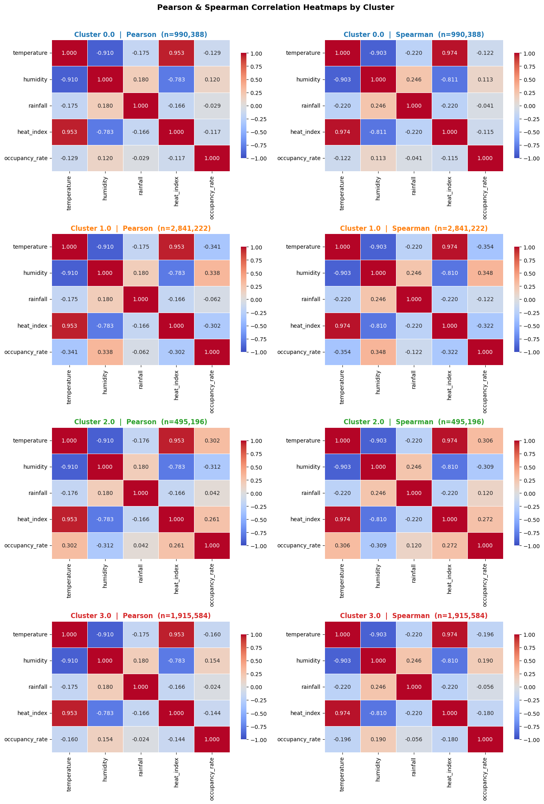

# Singapore Carpark Demand & "Parking Deserts"

How do weather and time of day drive HDB carpark demand, and can we flag **parking deserts** (hours at ≥ 90% occupancy) before they happen?

Team project for NTU **SC3021 Data Science Fundamentals** (Jan – Apr 2026), structured on the Ask → Prepare → Process → Analyse → Share → Act workflow. The full analysis, with code, outputs and discussion, is in [`parking_demand_analysis.ipynb`](parking_demand_analysis.ipynb).

## Data

- **4 Data.gov.sg APIs:** HDB carpark availability, rainfall (70 stations), relative humidity (17 stations) and air temperature (17 stations), for 2024.
- **7.8M carpark records** after cleaning, across 1,982 carparks.
- **Engineered features:** heat index, weekend flag, hour of day, 2-hour rolling rainfall, 3-hourly aggregates, per-carpark z-scores.

The scripts in [`data_collection/`](data_collection) pull the raw data at 30-minute resolution, with retry and rate-limit handling. The CSVs aren't committed because of their size; set `START_DATE` / `END_DATE` in each script to regenerate them.

## Findings

**1. Four carpark archetypes.** k-Means (k = 4) on each carpark's hourly occupancy profile separated 1,981 carparks into chronic parking deserts (dense residential), steady commuter, counter-cyclical (commercial and leisure) and underutilised groups.

**2. A Simpson's Paradox in the weather effect.** Pooled over all carparks, hotter weather means lower occupancy (heat index r = −0.54). Split by archetype, the counter-cyclical cluster reverses the sign of every weather correlation. The pooled trend is an artefact of mixing carpark types, not one relationship.

**3. Early warning for parking deserts.** A logistic-regression classifier caught **75% of ≥ 90% occupancy hours** at 1.7× base-rate precision. For a planner, a missed desert costs more than a false alarm, so the model is tuned for recall.

**Also:** rainfall barely matters (|r| < 0.13 in every cluster), likely because Singapore's sheltered walkways decouple it from driving. Z-score anomaly detection picked out Sunday mornings in January and Chinese New Year as the most unusual periods.

## Limitations, and what I'd fix

- **Leakage:** clusters were fitted on the full period before the train/test split, then used as a feature. They should be fitted on the training period only.
- **Encoding:** the cluster ID went into the logistic regression as a single number (0–3), which implies an order that doesn't exist. It should be one-hot encoded.
- **Split:** a random 70/30 split on time-series data. A chronological split would test real forecasting.
- **Accuracy:** 62% accuracy is below the all-negative baseline. The model is useful for recall only, which is how it is framed above.

## Stack

Python · Pandas · NumPy · scikit-learn · statsmodels · SciPy · seaborn · ydata-profiling · Google Colab

## Team

Ethan Kok ([@ethankok](https://github.com/ethankok)) · Rui Heng ([@TehBingLessSugar](https://github.com/TehBingLessSugar)) · David Sim ([@daaavidsim](https://github.com/daaavidsim))
